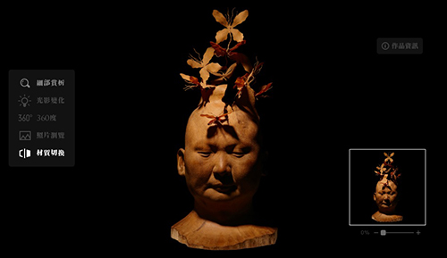
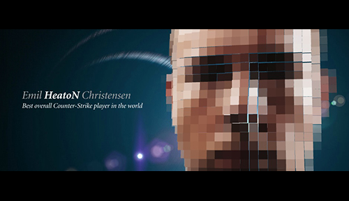
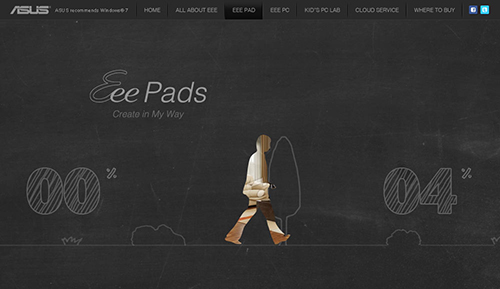
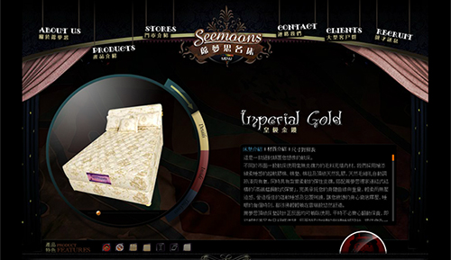

## 工作經驗 ( Work experience )

#### 遊戲橘子數位科技有限公司 黑盒子研究專案

<table>
  <tr>
    <th width="10%">職稱</th>
    <th width="50%">技術專案經理</th>
    <th width="10%">時間</th>
    <th width="30%">2019/06 - 2020/06</th>
  </tr>
  <tr><td colspan=4>
    <ul>
      <li> 設計並規劃專案系統架構，並逐一完成各系統與整合運作
      <li> 規劃整體系統架構基於 Google Cloud Platform 雲端運作與環境統一化架構基於 Docker 虛擬容器
      <li> 商轉並重構，將過往研究型演算法商轉至雲端系統
      <li> 整合過往外包專案與專案需求，開發各類系統以完成目標的服務與產出
      <li> 依據專案需求撰寫規劃書，並協商與管理外包廠商開發、研究單位進度
    </ul>
  </td></tr>
</table>

##### 專案與產品 ( Project & Product )

+ 雲端系統
  - 時間：2019/06 – 2020/06
  - 專案目標：設計並開發一個應用程式介面，供內部開發運端系統操作腳本
  - 語言與框架：Windows batch script、Linux shell script、GCP gsutil SDK
  - 內容描述：
    + 確保環境一致性，完成 Docker 容器化
    + 設計與規劃符合應用腳本撰寫，並補充 Google Cloud Platform 運用腳本
    + 依據系統架構規劃，設計雲端倉儲的檔案架構、雲端運算主機的佈署架構

+ 行為統計分析系統
  - 時間：2019/06 – 2020/06
  - 專案目標：整合研究單位演算方案，重構其運算流程達到改善效能與完善資料清洗方式
  - 語言與框架：Python
  - 內容描述：
    + 確保環境一致性，完成 Docker 容器化；
    + 整合並重構聲音偵測系統、臉部情緒辨識系統、行為分析報告運算系統
    + 規劃並設計人聲過濾系統，強化資料清洗結果，提供更多特徵參數供分析演算

+ 前端錄製系統
  - 時間：2019/06 – 2020/06
  - 專案目標：開發適用於遊戲場域內與行為分析需要的錄音、錄影機制
  - 語言與框架：Windows batch script、OBS、shinobi、ffmpeg
  - 內容描述：
    + 確保環境一致性，完成 Docker 容器化
    + 依據場域需要配置錄音、錄影設備，協助木工師傅設計遊戲桌台、協助裝潢單位規劃線路與空間施工方向
    + 設計並規劃錄音、錄影可自動化錄製、上傳雲端機制

+ 官方網站、報告網站、報告系統
  - 時間：2019/06 – 2019/12
  - 專案目標：整合網站專案並開發報告產生系統
  - 語言與框架：PHP & MySQL、PHP Laravel & MySQL、Node.js & Gitbook
  - 內容描述：
    + 確保環境一致性，完成 Docker 容器化
    + 設計 Git 開發流程，完成開發、產品兩線運作
    + 完成由 md 格式轉換各類系統文檔、電子書的系統設計

+ 場景管理系統
  - 時間：2020/01 – 2020/04
  - 專案目標：開發適用於遊戲場域內的區域網路控制器與遊戲狀態記錄系統
  - 語言與框架：Node.js - Express & Mongodb
  - 內容描述：
    + 確保環境一致性，完成 Docker 容器化
    + 設計與規劃場景管理系統規劃書與管理開發商的開發進度
    + 確保開發商技術方向並未偏離可維護的方向

+ 觀察輔助系統
  - 時間：2020/01 – 2020/05
  - 專案目標：開發適用於遊戲場域內的區域網路控制器與遊戲狀態記錄系統
  - 語言與框架：Node.js - Express, Next, React & Mongodb & Wowza
  - 內容描述：
    + 確保環境一致性，完成 Docker 容器化
    + 依據觀察與評量方式需要，設計用於資料呈現與運算的輔助系統
    + 依據行為分析演算需要，設計用於資料清洗的記錄系統

#### 遊戲橘子數位科技有限公司

<table>
  <tr>
    <th width="10%">職稱</th>
    <th width="50%">技術顧問</th>
    <th width="10%">時間</th>
    <th width="30%">2018/04 - 2019/06</th>
  </tr>
  <tr><td colspan=4>
    <ul>
      <li> 導入文件編輯機制，版本控制觀念。
      <li> 分析現有遊戲規則轉至數位化的設計問題，並協助與數位化設計廠商規格與文件制定。
      <li> 設計與規劃整合系統，並協助確認演算法機制的收斂與改善方向。
    </ul>
  </td></tr>
</table>

#### 優訊軟體科技有限公司

<table>
  <tr>
    <th width="10%">部門 職稱</th>
    <th width="50%">Technical Research & Solution 軟體架構師</th>
    <th width="10%">時間</th>
    <th width="30%">2016/09 – 2019/06</th>
  </tr>
  <tr><td colspan=4>
    <ul>
      <li> 前端軟體架構重構、客戶端電腦應用程式規劃與設計、全應用程式編譯與部屬架構規劃與設計。
      <li> 前端專案依賴 ( 第三方函式庫 ) 管理，包括必要性確認、更新、核心引用程式修改。
      <li> 軟體持續整合 ( Continuous integration )，研究軟體架構、語法，持續改善專案與團隊技術。
      <li> 產品開發前研究，針對產品進行需求分析、軟體開發與規劃。或確認第三方元件函式庫引用必要性與方案設計。
    </ul>
  </td></tr>
</table>

##### 專案與產品 ( Project & Product )

+ 前端軟體架構重構
  - 時間：2016/09 – 2019/06
  - 專案目標：解析當前產品，並以優化軟體效能、開發方式為改善目標。
  - 內容描述：
    + 管理與持續改善 Webpack 框架
    + 建置 Dummy server，使用 NodeJS & json-server
    + 建置 Sanity test framework，使用 NodeJS & Jest
    + 建置靜態資源分離系統，其功能需整合 AWS、Nginx、Jenkins、Docker、Webpack
    + 設計與規劃 MVC & MVP 混合框架，使用 PureMVC & React-Redux
    + 設計與規劃 Service & Callback、Pipe & Filter 框架

+ 行動裝置應用程式編譯、部屬架構重構
  - 時間：2016/09 – 2019/06
  - 專案目標：移除冗餘編譯架構，重構一致性的部屬環境
  - 內容描述：
    + 整合 Jenkins 腳本，移除舊 Jenkins 獨立編譯主機
    + 建構 AWS 為中心的資源管理、更新架構
    + 重構 Android 編譯流程，導入 Docker 達到編譯環境虛擬化
    + 重構 iOS 編譯流程，導入 Vagrant 達到編譯環境虛擬化

+ 客戶端電腦應用程式規劃與設計
  - 時間：2018/04 – 2019/06
  - 專案目標：重構舊客戶端軟體，並整合編譯、部屬架構。
  - 內容描述：
    + 建構 AWS 為中心的資源管理、更新架構
    + 建置虛擬化編譯環境，用以編譯出 Windows、Mac 可使用之應用程式
    + 設計與規劃 Electron 框架，導入 Auto-Update 機制，並依需求設計軟體功能

+ 產品前開發
  - 時間：2016/12 – 2017/04
  - 專案項目：
    + 社群軟體自動回應系統 ( Python auto-response system )
    + 分散式叢集數據演算系統 ( Docker & SparkR cluster system )

#### 杰星有限公司

<table>
  <tr>
    <th width="10%">職稱</th>
    <th width="50%">資深程式設計師</th>
    <th width="10%">時間</th>
    <th width="30%">2015/10 – 2016/08</th>
  </tr>
  <tr><td colspan=4>
    <ul>
      <li> 配合專案進度設計前端使用者介面。
      <li> 改進與設計 Android 使用者介面架構框架、Unity 系統架構框架。
      <li> 設計模組化核心，確保合作開發可以據此運作。
      <li> 確認第三方元件函式庫，確保其函式庫更新與內容運作正常。
    </ul>
  </td></tr>
</table>

##### 專案與產品 ( Project & Product )

+ Unity應用程式 ( Unity application )
  - 研究連結：https://github.com/eastmoon/tutorial-unity
  - 時間：2016/05 - 現在
  - 專案目標：使用 Unity 開發老虎機 ( Slot machine )。
  - 內容描述：
    + 前端基底為 C# Unity 函式庫、PureMVC 為架構設計基底。
    + 規劃與設計遊戲規則架構、顯示元件建構者、管線與過濾架構。
    + 設計觀察者 ( observer )、中介 ( mediator )、命令 ( command ) 樣式；設計粒子動畫、繪圖系統、緩速動畫 ( Easing animation ) 系統。

+ Android 應用程式 ( Android application )
  - 研究連結：https://github.com/eastmoon/tutorial-android
  - 時間：2016/02 - 現在
  - 專案目標：使用 Android 開發彩票遊戲應用程式。
  - 內容描述：
    + 後端基底為 PHP、RESTFul Web API。
    + 前端基底為 Android 函式庫、MVC 架構。
    + 設計符合 DOM Level 2 的事件系統、進程系統與管線與過濾架構樣式。
    + 模組化網路連線服務，基於 OkHttp 函式庫；模組化串流視頻撥放器，基於 Brightcove 函式庫。

+ 行動裝置網站嵌入PhoneGap ( Mobile WebSite in PhoneGap )
  - 研究連結：https://github.com/eastmoon/tutorial-cross-platform-sdk
  - 時間：2015/10 - 2016/02
  - 專案目標：使用網頁開發彩票應用程式，可兼容於網頁與行動裝置。
  - 內容描述：
    + 前端基底為 Angular 資料模組框架、 jQuery Mobile 為 RWD 系統。
    + 網頁嵌入行動裝置使用 PhoneGap 系統。

#### Freelancer

<table>
  <tr>
    <th width="10%">職稱</th>
    <th width="50%">遊戲設計與軟體技術顧問</th>
    <th width="10%">時間</th>
    <th width="30%">2014/08 - 2015/10</th>
  </tr>
  <tr><td colspan=4>
    <ul>
      <li> 經朋友、專案管理人、政府單位接獲專案。
      <li> 設計與管理專案進度，並針對顧客需求進行討論與分析。
      <li> 於專案檢核前，實務並完成專案。
    </ul>
  </td></tr>
</table>

##### 專案與產品 ( Project & Product )

+ 時間軸腳本閱讀器 ( Timeline Script Reader )
  - 研究連結：https://github.com/eastmoon/timeline-script-reader-project
  - 時間：2015/04 - 2015/07
  - 專案目標：使用C#與Unity設計腳本 ( Script ) 閱讀器，並可於執行期間運作。
  - 內容描述：
    + 模擬吉里吉里 ( Krikri ) 腳本內容，設計對應的腳本命令，並移除無可用性命與翻譯日文原文參考文件。
    + 修改吉里吉里 ( Krikri ) 腳本系統兼容於作業系統問題。
    + 設計腳本閱讀器，採用命令 ( Command )、輕量 ( Flyweight ) 樣式。

+ 棒球記錄系統  ( Baseball recording system )
  - 時間：2014/08 - 2015/02
  - 專案目標：更新資料庫系統與增加記錄規則。
  - 內容描述：
    + 修改與更新棒球記錄系統，原始系統設計於2006年。

#### 雷比斯互動科技公司 ( Lapis interaction tech corp. )

<table>
  <tr>
    <th width="10%">職稱</th>
    <th width="50%">遊戲設計顧問與技術支援</th>
    <th width="10%">時間</th>
    <th width="30%">2012/10 - 2014/08</th>
  </tr>
  <tr><td colspan=4>
    <ul>
      <li> 在2013/05前，主要工作為技術支援與教導開發者相關技術，定義與建構基礎的使用者介面。
      <li> 在2013/05後，主要工作為遊戲設計顧問與專案管理，領導六位成員，其中2位為接案人員： 3位程式設計師、2位美術設計師、1位企劃人員。
      <li> 協助企劃設計遊戲規則、使用者介面。
      <li> 協調軟體開發者以偵測系統錯誤，當此錯誤涵蓋前端、後端開發者。
      <li> 協調接案美術設計師工作細節。
    </ul>
  </td></tr>
</table>

##### 專案與產品 ( Project & Product )

+ Lapis Bellum
  - 專案目標：開發網頁策略遊戲。
  - 內容描述：
    + 代理者系統 ( agent system ) 基底為 C#，處理戰鬥報告計算與建立
    + 後端基底為 PHP、簡易 SOAP Web API。
    + 前端基底為 Flash Action Script、MVC 架構。

#### 歐拔藍設計 ( Albert Lan Creative )

<table>
  <tr>
    <th width="10%">職稱</th>
    <th width="50%">軟體架構師</th>
    <th width="10%">時間</th>
    <th width="30%">2008/10 - 2013/05</th>
  </tr>
  <tr><td colspan=4>
    <ul>
      <li> 依據專案需求設計使用者介面。
      <li> 2012年前，主要設計全版面Flash應用程式、豐富式網際網路應用程式 ( RIA )。
      <li> 2012年後，設計局部型Flash互動系統。
      <li> 設計使用者介面動畫、影片撥放器、筆刷演算法、動態背景演算法、隨機合成音樂演算法。
    </ul>
  </td></tr>
</table>

##### 專案與產品 ( Project & Product )

+ Flash 網頁應用程式 ( Flash Web Application )
  - 專案列表：
  - 2011、2012 - ASUS, Product website
  - 2011 - WuChing, Official website
  - 2010 - BenQ, Campaign website
  - 2010 - GigaByte, Campaign website
  - 2010 - Lumi Dance School, Official website
  - 2009 - Seemoons, Official website
  - 2009 - Intel, Campaign website
  - 2008、2009 - MSI, Product Website
  - 2008 - Roulette Game
  - 2007 - SonyVaio, Official website
  - 2007 - RichJade, Official website

<table border="0">
  <tr>
    <td></td>
    <td></td>
  </tr>
  <tr>
    <td></td>
    <td></td>
  </tr>
  <tr>
    <td></td>
    <td></td>
  </tr>
</table>

&nbsp;

&nbsp;

+ Air App：
  - 2013 - ASUS POS APP

<table border="0">
  <tr>
    <td></td>
    <td></td>
  </tr>
</table>

+ 演算法：
  - 專案目標：使用Flash action script設計特殊演算法，以減少下載內容總量、增加動畫的互動與變異性。
  - 內容描述：
    + 合成影像。
    + 音樂撥放器與聲音控制器。
    + 超大影像下載系統。

<table border="0">
  <tr>
    <td></td>
    <td></td>
  </tr>
</table>

#### 國立台北科技大學 ( National Taipei University of Technology )

<table>
  <tr>
    <th width="10%">職稱</th>
    <th width="50%">實驗室助理</th>
    <th width="10%">時間</th>
    <th width="30%">2006/06 - 2008/02</th>
  </tr>
  <tr><td colspan=4>
    <ul>
      <li> 與合作單位進行需求討論與分析。
      <li> 負責設計使用者介面、資料庫存取核心系統。
    </ul>
  </td></tr>
</table>

##### 專案與產品 ( Project & Product )

+ 棒球記錄系統  ( Baseball recording system )
  - 專案名稱：使用視訊資料庫與視覺介面的棒球競賽內容數位化
  - 專案目標：使用數位化方式記錄棒球比賽，並提供網頁搜尋比賽記錄。
  - 內容描述：
    + 基於棒球規則來記錄與計算分數。
    + 存取 Access 檔案、建立球隊資訊、設定比賽資訊、設定參賽球員，並產生 HTML 報表。
    + 延伸子系統：完整比賽記錄系統、簡易比賽記錄系統、比賽播放系統。
